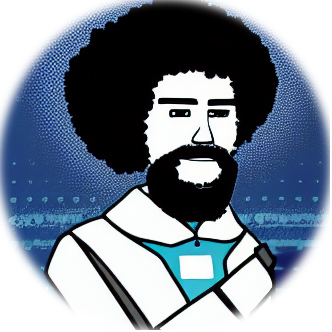
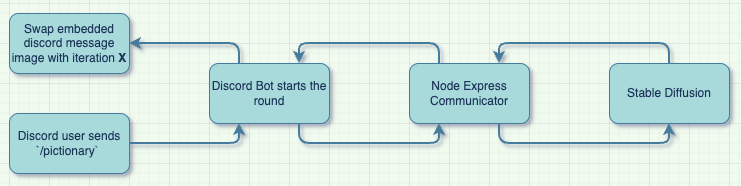

<p align="center">
    
</p>

<p align="center">
  <a href="https://specularrealms.com">Website</a>
  ·
  <a href="#getting-started-">Getting Started</a>
  ·
  <a href="https://specularrealms.com/2022/10/04/stable-diffusion-pictionary-with-bot-ross/">Blog Article</a>
</p>


- [About](#about)
- [Getting Started](#getting-started-)
    * [Install Stable Diffusion](#install-stable-diffusion)
    * [Clone the Pictionary Repo](#clone-the-pictionary-repo)
    * [Set up the node express communicator](#set-up-the-node-express-communicator)
    * [Set up the Discord Bot](#set-up-the-discord-bot)
- [Logic](#logic-)
    * [UML Diagram](#uml-diagram)
    * [Components](#components)
- [Credits](#credits-)
- [Support and Questions](#support-and-questions-)


# About

Bot Ross 🤖 lets you play a game of Pictionary with your friends. The game is played in a Discord server, and the bot will guide you through the game, generating pictures by fetching images generated by a server running an instance of Stable Diffusion. You can read the dev diary for more information on the project, available [here]().

# Getting Started 🏁

## Install Stable Diffusion

You'll need to install the fastapi enabled fork of AUTOMATIC1111 Stable Diffusion. You can find the fork [here](https://github.com/TomJamesPearce/stable-diffusion-webui-api). Follow the instructions in the README to get the server running. Launch the python web server with the following command:

```bash
python launch.py --api
```
Verify you can successfully generate images via postman GET requests to your localhost.

## Clone the Pictionary Repo

Clone the pictionary repo to your local machine:

```bash
git clone https://github.com/scpedicini/pictionary.git
npm install
```

## Set up the node express communicator

Add an `.env` file to the root of the diffusion-communicator project with the following contents:

```bash
LOCAL_WIN_PORT=8000 # the port diffusion communicator is running on
BEARER_TOKEN=<random string> # a random string which is used to authenticate requests from discord bot
STABLE_DIFFUSION_ENDPOINT=http://localhost:7861/v1/txt2img # the endpoint for stable diffusion
```


Then, run the diffusion communicator with the following command:
```bash
npm run start
```

## Set up the Discord Bot

Before you can run the discord bot, you'll need to create a discord bot and add it to your server, also known as a guild. You can find instructions on how to do this [here](https://discordjs.guide/preparations/setting-up-a-bot-application.html).

Since the bot needs to be able to listen to incoming guesses by the players, you'll need to grant the bot privileged gateway intents. You can find instructions on how to do this [here](https://discordjs.guide/popular-topics/intents.html#privileged-intents). Specifically you'll need to enable the Message Content Intent in the Developer Portal for your bot.

Use OAUth2 -> URL Generator and add `bot` and `applications.commands`, and then add necessary bot permissions - this will give you a generated URL which you can paste in a web browser, and from there can add the bot to a server. The minimal permissions needed are: `Send Messages`, `Manage Messages`, `Read Message History`, `Attach Files`, and `Embed Links`.

Once you've created your bot, you'll need to add the bot token to the `.env` file in the discord-bot project. The `.env` file should look like this:

```bash
BOT_TOKEN=<your bot token>
APP_ID=<your app id>
COMMUNICATOR_ENDPOINT=http://localhost:8000 # the endpoint for the diffusion communicator
DEV_COMMUNICATOR_ENDPOINT=http://localhost:8000 # the endpoint for the diffusion communicator
BEARER_TOKEN=<random string> # the same random string you used for the diffusion communicator
```

Then, run the discord bot with the following command:
```bash
npm run start
```

Due to some outstanding interaction handling issues, it's advised that you run the discord bot using a relaunch application, such as [pm2](https://www.npmjs.com/package/pm2). You can install pm2 globally with the following command:

```bash
npm install pm2 -g
```

There is already a pm2 config script in the package.json file, so you can run the bot with the following command:

```bash
npm run pm2-prod
```

If you've set up everything correctly, you should be able to run the command `/pictionary` in your discord server and start a game of pictionary. Use the `/ping` command to verify that the bot is running.

# Logic 🧩

## UML Diagram



## Components 

There are three major pieces to the pictionary bot:

1. Stable Diffusion - a python server using uvicorn which generates images
2. Diffusion Communicator - a node express server which listens to incoming requests from the discord bot, and forwards authenticated messages to Stable Diffusion.
3. Discord Bot - a discord bot which manages the game state, and makes image generation requests to the diffusion communicator.


# Credits 🙏

This project would not have been possible without the tireless efforts of the AI open-source community at large. Big shoutout to [AUTOMATIC1111](https://github.com/AUTOMATIC1111) who currently hosts one of the best Gradio UI/UX frontends for running Stable Diffusion.

# Support and Questions 🤔

🔥 This project was written in a drunken stupor and is not production ready. It was originally intended to be run only on a single discord guild and cannot scale. You are welcome to submit a PR to help improve the project. Use at your own risk. 🔥

This project was a lot of fun to work on, and I learned a lot about how to build a discord bot, and how to use Stable Diffusion. I hope you enjoy playing the game as much as I enjoyed building it. If you have any questions, feel free to reach out to me on [twitter](https://twitter.com/wunderbaba), or open an issue on the repo.